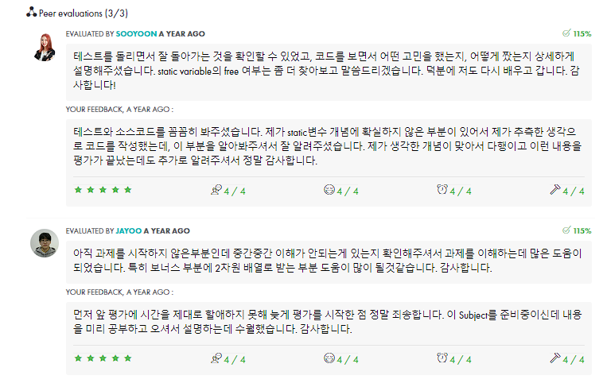

# 1. Subject
- [Subject](https://github.com/hotkimho/42cursus/tree/master/gnl)

# 2. 규칙
- `전역변수`는 사용할 수 없습니다
-  필요한 함수는 직접 구현해야합니다.
- `허용하는 함수(system call)`외에 모든 함수의 사용을 금지합니다.

# 3. GNL(Get Next Line)은 어떤 프로젝트 인가요?
파일을 읽을 땐 일정한 크기의 `버퍼`를 사용하여 `read`합니다. 이 버퍼의 크기는 보통 시스템내에서 일정한
크기로 정의되어 있거나 사용자가 직접 정의합니다.

GNL은 어떤 `파일(file descriptor)`을 읽을 때 `버퍼의 크기`를 직접 정의하고 버퍼의 크기가 `굉장히 크거나 작아도`
파일을 `구분자(문제에서는 newline)`로 구분하여 읽고 반환하는 함수입니다.

# 4. 함수 원형
`int get_next_line(int fd, char **line)`

함수는 2개의 인자를 받습니다.

첫 번째 인자는 파일에 대한 `fd(파일 디스크립터)`를 받습니다.

두 번째 인자는 파일 디스크립터에서 읽은 내용중 `newline(개행)`까지의 문자열을 저장합니다.

반환 값이 정수형인 이유는 아래와 같습니다.  
- 정상 동작 `1`
- EOF에 도달한 경우 `0`
- 에러가 발생한 경우 `-`  

# 4. 허용 함수 및 내용
- `Static` 변수
- `write`, `malloc`, `free`
- 이외의 함수는 허용하지 않으며, 필요한 문자열 함수는 직접 구현해야합니다.

# 5. Bonus
`int get_next_line(int fd, char **line)`

`기본(mandantory)`는 1개의 파일만 매개변수로 들어옵니다. `bonus`는 `여러 개`의 파일들을 처리해야 합니다.

# 6. 후기 및 내용 정리
[후기 및 정리](https://hotkimho.github.io/docs/42Seoul_GNL/review)

# 7. 평가

