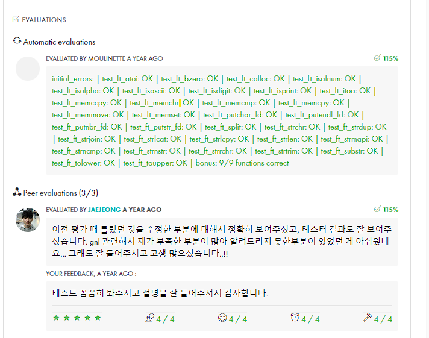
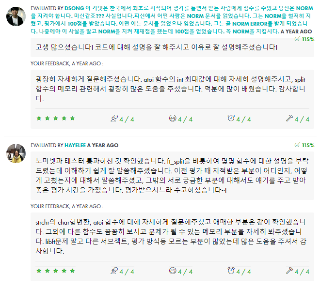
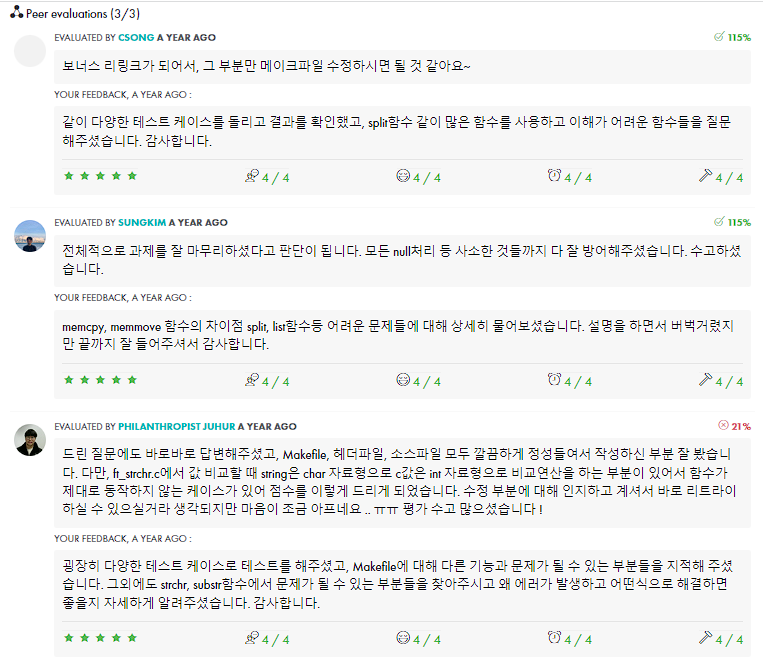

# 1. Subject
- [Subject](https://github.com/hotkimho/42cursus/blob/master/libft/reference/libft_subject.pdf)

# 2. 규칙
- `전역변수`는 사용할 수 없습니다
- `ar` 명령어를 사용하여 라이브러리를 만들어야 합니다.
- `man`에 정의 되어 있는 함수 그대로 구현해야 하며 맨 앞에 `ft_`를 붙여 정의합니다.
- `허용하는 함수(system call)`외에 모든 함수의 사용을 금지합니다.
-
# 2. Libft는 무엇인가요?
앞으로 사용할 c 라이브러리 함수를 제작하는 것입니다

# 3. 구현해야할 함수 목록
- `isalpha`, `isdigit`, `isalnum`, `isascii`, `isprint`
- `strlen`, `memset`, `bzero`, `memcpy`, `memmove`, `strlcpy`, `strlcat`, `strncmp`
- `toupper`, `tolower`, `strchr`, `strrchr`
- `memchr`, `memcmp`, `strnstr`, `atoi`

아래 함수들은 `malloc`를 사용하여 구현합니다.
- `calloc`, `strdup`

# 4. 허용 함수
- `write`, `malloc`, `free`

# 5. Bonus
`보너스 파트`는 `기존 과제`를 수행해야 평가를 진행합니다. `기본과제에 문제가 있으면` 보너스는 무시됩니다.

```c
typedef struct s_list
{
    void          *content;
    struct s_list *next;
}             t_list;
```
위의 구조체를 사용하여 연결리스트 함수를 구현합니다.

# 5. Bonus 함수 목록
- `void ft_lstadd_front(t_list **lst, t_list *new)`
  - 리스트의 맨 앞에 `new`를 추가합니다
- `int ft_lstsize(t_list *lst)`
  - 리스트의 길이를 반환합니다
- `t_list *ft_lstlast(t_list *lst)`
  - 리스트의 맨 마지막 요소를 반환합니다.
- `void ft_lstadd_back(t_list **lst, t_list *new)`
  - 리스트의 맨 뒤에 `new`를 추가합니다.
- `void ft_lstdelone(t_list *lst, void (*del)(void*))`
  - `lst`를 삭제하며, 삭제에 사용되는 함수포인터 `del`를 받습니다
- `void ft_lstclear(t_list **lst, void (*del)(void *))`
  - `lst`를 시작으로 모든 노드를 삭제합니다. 삭제에 사용되는 함수포인터 `del`를 받습니다
- `void ft_lstiter(t_list *lst, void (*f)(void *))`
  - `lst`를 순회하며 각각의 노드에 `f` 함수포인터가 가르키는 함수를 적용합니다.
- `t_list *ft_lstmap(t_list *lst, void *(*f)(void *), void (*del)(void *))`
  - `lst`를 순회하며 각각의 노드에 `f` 함수를 적용시킨 새로운 연결리스트를 반환합니다. 필요 시 `del`함수를 사용해 노드를 삭제합니다.

# 6. 요약
이 프로젝트는 앞으로 사용할 함수들을 구현하는 것입니다.
이후의 과제들은 필요 시, `libft`를 사용할 수 있습니다

# 7. 평가




