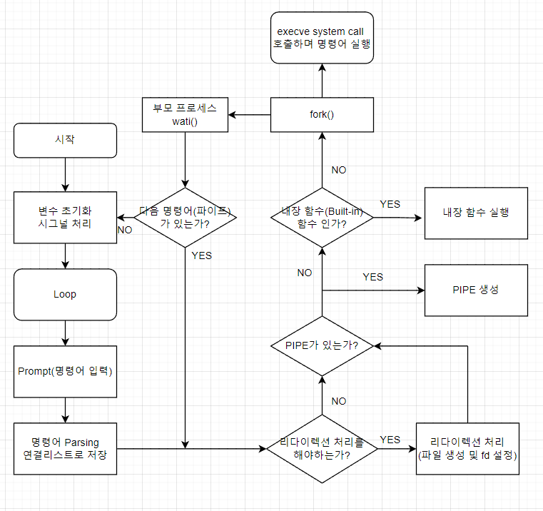

# 1. Subject
- [Subject](https://github.com/hotkimho/42cursus/blob/master/minishell/reference/minishell_subject.pdf)
- `파이프`, `파일 디스크립터`에 대해 알고 있는 가정하에 글을 작성했습니다.

# 2. Minishell
`Minishell`은 `리눅스, 유닉스`의 `Bash`쉘을 만드는 `2인 팀` 프로젝트입니다.

### 내장 기능
Minishell은 다음의 내장 기능을 실행할 수 있어야 합니다.

- `echo`
  - `-n` 옵션을 포함한 echo 기능
- `cd`
  - `절대`, `상대`경로를 사용하는 cd이며, 에러 시 동작, 에러코드는 `Bash`와 같아야 합니다.
- `pwd`
  - 옵션이 없는 `pwd`, 인수가 있는 경우 `Bash`와 같게 동작합니다
- `export`
  - `key`값에 대한 허용 문자는 `Bash`와 똑같이 동작해야 합니다. 
- `unset`
  - 옵션이 없는 `unset`
- `env`
  - 옵션이 없는 `env`
- `exit`
  - 옵션이 없는 `exit`, `long long`을 넘어서는 값에는 문자열로 처리합니다. 에러코드, 동작은 `Bash`와 같게합니다.

### 리다이렉션(Redirection)
- `<`
  - 입력 리다이렉션 기능을 구현합니다.
- `>` 
  - 출력 리다이렉션 기능을 구현합니다.
- `<<`(heredoc)
  - 구분자를 만날 때 까지 입력값을 받아들입니다.
- `>>`
  - 출력 리다이렉션을 의미하며 내용이 추가됩니다.

### 파이프
`|` 각 파이프라인마다 명령어의 출력값이 파이프로 연결되어 다음 명령어의 입력값으로 들어갑니다.

하지만 출력 리다이렉션 구현 시, `zsh`은 입력값이 넘어가지만 `bash`는 넘어가지 않아서 `bash`를 기준으로 구현했습니다.

### etc
- `$?` 입력시 최근 실행한 명령어의 에러코드를 출력해야합니다.
- `'`는 문자열에 대한 해석을 하지 않습니다.
- `", $`를 제외한 모든 문자열에 대한 해석을 하지 않습니다.
- 이외에 적혀있지 않은 기능은 `Bash`를 참고하며 똑같이 동작해야합니다.

# 3. 허용 함수
- malloc, free
- read, write, open, close,
- opendir, readdir, closedir
- getcwd, chdir
- stat, lstat, fstat
- fork, execve
- wait, waitpid, wait3, wait4
- signal, kill
- exit
- strerror, errno
- dup, dup2, pipe

# 4. 역할 분담
minishell은 `2인 팀`프로젝트입니다. 저희 팀은 minishell을 크게 `파싱부`, `실행부`로 기능을 정의하였고 각자 1파트씩
하기로 했습니다. 

저는 `실행부`를 맡았으며, 팀원분이 `파싱`된 명령어를 `연결 리스트`형태로 넘겨주면 이를 분석하고 실행하는 로직을 구현했습니다.

# 5. Flow Chart

# 6. 내장 함수 동작 및 에러 처리
### echo
- `옵션이 없는 경우` 문자열을 출력 후 `개행(\n)`을 합니다
- `-n 옵션` -n으로 시작하는 경우 `개행(\n)`을 하지 않습니다
  - `-ntest~~` 인 경우에도 `-n`옵션으로 동작합니다.

### cd
- `cd arg1 arg2` 인자가 2개 이상이면 에러 메시지를 출력합니다.
- `cd ~, cd ~ arg1` 홈 디렉토리로 이동합니다
- `$HOME 환경 변수를 삭제한 경우` `HOME` 환경변수가 없다는 에러 메시지를 출력합니다
- `잘못된 경로 또는 권한이 없는 폴더인 경우` 에러 메시지를 출력합니다.
- `cd $HOME` 홈 디렉토리로 이동하며, 환경 변수가 경로를 가지고 있을경우 경로로 이동합니다.
- `$OLDPWD, $PWD` 이동하기 직전의 경로, 현재 경로를 환경변수로 가지고 있습니다.

### pwd
- `pwd arg1 arg2` 인자가 2개 이상이면 에러 메시지를 출력합니다.

### export
- `export a` 값을 가지는 환경변수가 아니라 `env`명령으로 노출되지 않습니다.
- 이미 존재하는 환경변수값을 등록하면 새로 입력한 값으로 변경됩니다.
- `key`는 문자, 숫자, _로 시작해야합니다.

### unset
- 입력된 환경변수 키가 있다면 삭제, 없다면 아무런 에러를 띄우지 않습니다.

### exit
- `exit` 입력되면 exit 메시지를 출력 후 종료합니다.
- `exit error_code` 에러코드를 부모 프로세스한테 전달합니다.
- `exit numarg1, numarg2` 숫자 인자가 2개 이상 들어오면 에러 메시지 출력 후, 종료하지 않습니다.
- `exit strarg1, strarg2` 문자열 인자가 2개 이상 들어오면 에러 메시지를 출력 후, 종료합니다.

### env
- 환경 변수 목록을 출력합니다.

# 7. 후기
- `git`으로 이슈를 만들고, `PR`을 하는 과정으로 팀 프로젝트를 진행했습니다. 코드를 병합하는 과정 등등 많은 이슈가 있었고 좋은 경험이였습니다.
- 명령어 파싱을 `연결 리스트`로 구현되었지만, 만약 다음에 다시 구현할 기회가 있다면 `파스 트리`를 구현해보고 싶습니다.

# 8. 평가
