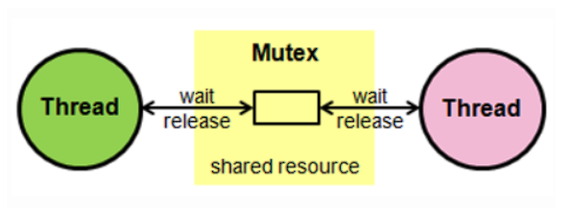
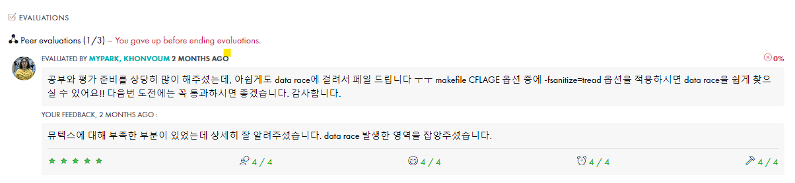
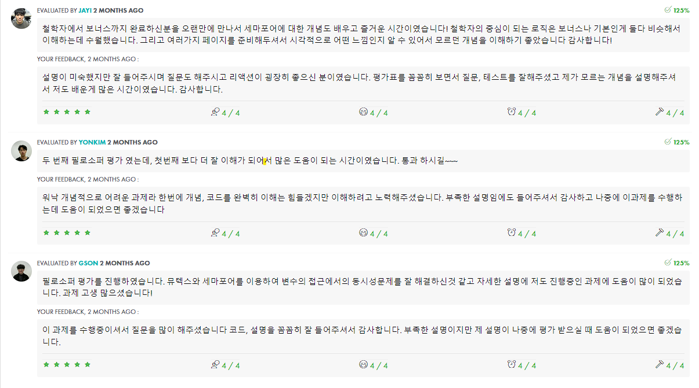

# 1. Subject
- [Subject](https://github.com/hotkimho/42cursus/tree/master/philosophers/reference)
- 해당 프로젝트는 스레드에 대한 지식이 필요합니다. [Thread](https://hotkimho.github.io/docs/OS/thread/)를 공부하여
정리한 내용입니다.
- 정리한 내용에는 `스레드`에 대한 설명이 없이 정리했습니다.

# 2. Philosophers
`Phoilosophers`는 운영체제의 동시성 문제를 대표하는 [식사하는 철학자](https://namu.wiki/w/%EC%8B%9D%EC%82%AC%ED%95%98%EB%8A%94%20%EC%B2%A0%ED%95%99%EC%9E%90%20%EB%AC%B8%EC%A0%9C)
문제를 `멀티스레드`, `멀티프로세싱(bonus 문제)`를 사용하여 해결하는 프로젝트입니다. `공유 자원`을 `뮤텍스, 세마포어`를 이용하여 보호하며 
시뮬레이션을 진행합니다.

### 식사하는 철학자
N명의 철학자들이 원탁에 앉아 식사를 합니다. 철학자들 사이에는 포크가 하나씩 있고 철학자들은 다음의 과정을 통해 식사를 합니다.
1. 일정 시간 생각 한다
2. 왼쪽 포크를 집을 수 있으면 집고, 집을 수 없다면 대기한다.
3. 오른쪽 포크를 집을 수 있으면 집고, 집을 수 없다면 대기한다.
4. 두 개의 포크를 집으면 일정 시간 식사를 한다.
5. 포크를 내려놓는다.
6. 1번으로 돌아가며 반복 한다.

얼핏보면 간단할 수 있는 내용입니다. 하지만 주의해야할 부분이 있습니다. 바로 `포크를 집을때까지 대기한다` 이 부분입니다.

만약 5명의 철학자가 있고 모든 철학자가 자기 왼쪽에 있는 포크를 집었습니다. 즉 현재 모든 포크는 사용중이지만 철학자들 또한 포크를 대기하는 상태입니다.
이렇게 아무것도 진행할 수 없는 상태를 `교착(Deadlock)`상태라고 하며 컴퓨터 관련하여 교착 상태는 꼭 피해야할 문제입니다.

### race condition, data race
위의 상황은 실제 컴퓨터 환경에서 발생할 수 있습니다. 철학자는 `thread`이고 포크는 `공유하는 자원`로 정의할 수 있습니다.
2개 이상의 thread가 `공유 자원`을 사용하면서, 실행되는 순서에 따라 결과가 달라질 수 있는 상황을 `race condition`상태라고 합니다.
그리고 race condition 상태에서 직접적으로 여러 개의 스레드가 `공유 자원`을 사용해서 발생하는 문제를 `data race`라고 합니다.
이는 `멀티 스레드` 상황에서 흔하게 발생하는 문제입니다. 이를 해결하기 위해선 `뮤텍스, 세마포어`를 사용하여 해결합니다.

### mutex
뮤텍스는 `공유 자원`을 `key`를 기반으로 동시에 실행되지 않고 key를 가진 thread(이하 객체라고 표현)만 접근하게 하는 기법입니다.
`mutex`는 주로 `임계영역`에 사용하며 `임계영역은 여러개의 객체들이 공유 자원을 사용하는 코드 영역`을 의미합니다.

출처 : https://heeonii.tistory.com/14

그림을 보면 `공유 자원`을 `mutex`로 묶어 사용하며 한 thread가 `key`를 가지고 임계영역에 진입에 공유 자원을 사용합니다.
이를 `Lock` 또는 `Wait`이라고 합니다. 즉 공유 자원에 대한 키를 얻어 사용하고 다른 thread는 공유 자원을 사용하는 thread가
키에대한 사용을 끝마지고 키를 `반환(UnLock, Post)` 하기 전까지 `대기`합니다. 한 thread가 사용을 마치고 키를 반환하면
대기하던 thread가 키를 받아 `Lock, Wait`을 한 후 공유 자원을 사용합니다.

이런 방식을 Mutex라고 하며 이렇게 함으로써 `공유되는 자원에 접근을 1개의 thraed`만 하여 `data race` 발생을 막을 수 있습니다.

c++에서 thread를 사용한 예제입니다. [pthread](https://hotkimho.github.io/docs/42Seoul_philosophers/functions/)

# 3. Philosophers 문제
### 행동
철학자는 최소 1명 이상이며, 둥근 테이블에 앉아 아래의 3가지 행동 중 1개를 합니다.
- 먹기
- 생각하기
- 잠자기

### 기본 룰
- 철학자는 1개의 행동을 하는 중 다른행동을 하지 않습니다. 현재 하는 행동이 끝나야 다른 행동을 합니다.
- 철학자는 원형 테이블에 앉아 있으며, 가운데에는 스파게티 그릇이 놓여져있습니다.
- 탁자 위에는 `철학자의 수`와 똑같은 수의 포크가 철학자의 `양옆`에 올려져 있습니다.
- 스파게티는 포크 하나론 먹을 수 없고 꼭 `2개의 포크`를 집어야 먹을 수 있습니다.
- 철학자는 굶고 있으면 안됩니다.
- 모든 철학자는 먹어야 합니다.
- 철학자는 서로 죽었는지 알아챌 수 없습니다

### 메인 룰
- 철학자는 포크를 집을 수 있으면 집습니다.
- 철학자가 2개의 포크를 집으면 밥을 먹습니다.
- 밥을 다 먹었으면, 포크를 내려놓고 잠을 잡니다.
- 잠을 다 자면 생각하기 시작합니다.
- 생각중 포크를 집을 수 있으면 포크를 집습니다.
- 위의 내용을 반복합니다.
- 철학자가 한명이라도 사망하면 시뮬레이션을 종료합니다.

### 프로그램 입력
- 철학자의 수 (number_of_philosophers): 테이블에 앉아 있는 철학자의 수와 포크의 수
- 철학자의 수명 (time_to_die): 밀리초 단위로, 철학자가 마지막으로 밥을 먹은 지 `time_to_die` 시간만큼이 지나거나, 프로그램 시작 후 `time_to_die` 시간만큼이 지나면 해당 철학자는 사망합니다.
- 밥을 먹는데 걸리는 시간 (time_to_eat) : 밀리초 단위로, 철학자가 밥을 먹는 데 걸리는 시간입니다. 해당 시간동안, 철학자는 두 개의 포크를 소유하고 있어야 합니다.
- 잠자는 시간 (time_to_sleep) : 밀리초 단위로, 잠을 자는 데 소모되는 시간입니다.
- 각 철학자가 최소한 밥을 먹어야 하는 횟수 (number_of_times_each_philosopher_must_eat) : 해당 인자값은 선택사항입니다. 모든 철학자가 `number_of_times_each_philosopher_must_eat` 횟수만큼 밥을 먹었다면, 시뮬레이션이 종료됩니다.
해당 값이 명시되어 있지 않다면, 철학자가 한 명이라도 사망할 때까지 시뮬레이션은 계속됩니다.
- 철학자는 1번부터 고유의 번호(id)가 부여됩니다.

### 프로그램 출력
- 철학자는 다음과 같이 형식으로 출력이 되어야 하며 `MS(밀리세컨드)`의 `timestamp`가 출력되어야 합니다.
- timestamp_in_ms X has taken a fork
- timestamp_in_ms X is eating
- timestamp_in_ms X is sleeping
- timestamp_in_ms X is thinking
- timestamp_in_ms X died

- 철학자가 사망하고 사망이 출력되기 까지 `10MS`의 오차가 있으면 안됩니다.
- 철학자는 최대한 안죽게 설계해야 합니다.

# 4. 허용 함수
`memset, printf, malloc, free, write, usleep, gettimeofday, pthread_create,
pthread_detach, pthread_join, pthread_mutex_init, pthread_mutex_destroy,
pthread_mutex_lock, pthread_mutex_unlock`

위 함수들은 블로그에 설명하여 정리했습니다. [thread](https://hotkimho.github.io/docs/42Seoul_philosophers/functions/)

# 5. Bonus
`메인 문제(thread)`를  `멀티 프로세스`방식을 사용하고 `semaphore`를 이용하여 `식사하는 철학자`문제를 해결합니다.
### semaphore를 이용한 식사하는 철학자 규칙
- 포크는 철학자의 양 옆이 아닌 가운데에 있습니다.
- 포크의 수는 `세마포어`로 표현됩니다.
- 각 철학자는 `프로세스`로 이루어저야하고 `메인 프로세스`가 철학자가 되어서는 안됩니다.

### semaphore 허용 함수
`memset, printf, malloc, free, write, fork, kill, exit, pthread_create, pthread_detach, pthread_join, usleep, gettimeofday, waitpid, sem_open, sem_close, sem_post, sem_wait, sem_unlink`

# 6. 요약
각각 `멀티스레드, 뮤텍스`, `멀티프로세스, 세마포어`를 이용하여 식사하는 철학자 문제를 해결하는 프로젝트입니다.

# 7. 평가

평가를 진행하던중 `data race`가 있었고 평가자분께서 이를 발견해주셨습니다. 덕분에 `data race`가 무엇인지, 어떻게 발생하고 해결하는지
잘 알게되었습니다. 이를 모르고 지나가면 아무 의미없는 과제가 될뻔했습니다. `MYPARK`님 감사합니다.

